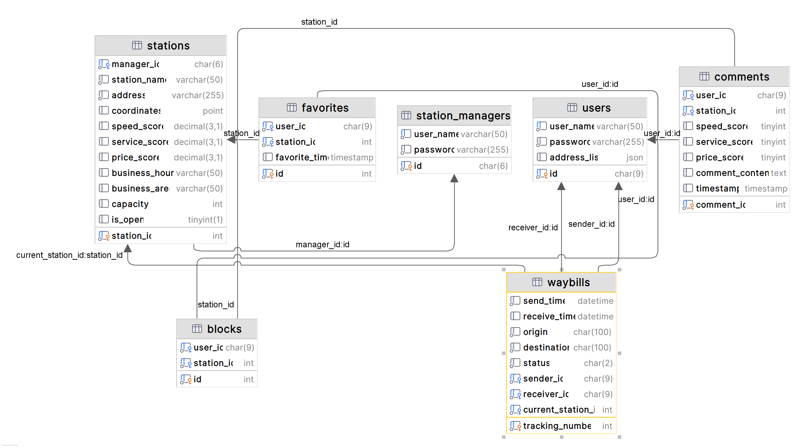

## 数据库详细设计

### Table: users 用户

| Field | Type | Null | Key | Default | Extra |
| --- | --- | --- | --- | --- | --- |
| id | char(9) | NO | PRI | NULL |  |
| user_name | varchar(50) | NO | UNI | NULL |  |
| password | varchar(255) | NO |  | NULL |  |
| address_list | json | YES |  | NULL |  |

### Table: station_managers 管理员

| Field | Type | Null | Key | Default | Extra |
| --- | --- | --- | --- | --- | --- |
| id | char(6) | NO | PRI | NULL |  |
| user_name | varchar(50) | NO | UNI | NULL |  |
| password | varchar(255) | NO |  | NULL |  |

### Table: stations 驿站

| Field | Type | Null | Key | Default | Extra |
| --- | --- | --- | --- | --- | --- |
| station_id | int | NO | PRI | NULL | auto_increment |
| manager_id | char(6) | NO | MUL | NULL |  |
| station_name | varchar(50) | NO |  | NULL |  |
| address | varchar(255) | NO |  | NULL |  |
| coordinates | point | YES |  | NULL |  |
| speed_score | decimal(3,1) | YES |  | NULL |  |
| service_score | decimal(3,1) | YES |  | NULL |  |
| price_score | decimal(3,1) | YES |  | NULL |  |
| business_hours | varchar(50) | YES |  | NULL |  |
| business_area | varchar(50) | YES |  | NULL |  |
| capacity | int | YES |  | NULL |  |
| is_open | tinyint(1) | YES |  | 1 |  |

### Table: comments 评论

| Field | Type | Null | Key | Default | Extra |
| --- | --- | --- | --- | --- | --- |
| comment_id | int | NO | PRI | NULL | auto_increment |
| user_id | char(9) | NO | MUL | NULL |  |
| station_id | int | NO | MUL | NULL |  |
| speed_score | tinyint | YES |  | NULL |  |
| service_score | tinyint | YES |  | NULL |  |
| price_score | tinyint | YES |  | NULL |  |
| comment_content | text | YES |  | NULL |  |
| timestamp | timestamp | YES |  | CURRENT_TIMESTAMP | DEFAULT_GENERATED |

### Table: favorites 收藏

| Field | Type | Null | Key | Default | Extra |
| --- | --- | --- | --- | --- | --- |
| id | int | NO | PRI | NULL | auto_increment |
| user_id | char(9) | NO | MUL | NULL |  |
| station_id | int | NO | MUL | NULL |  |
| favorite_time | timestamp | YES |  | CURRENT_TIMESTAMP | DEFAULT_GENERATED |

### Table: waybills 运单

| Field | Type | Null | Key | Default | Extra |
| --- | --- | --- | --- | --- | --- |
| tracking_number | int | NO | PRI | NULL | auto_increment |
| send_time | datetime | NO |  | NULL |  |
| receive_time | datetime | YES |  | NULL |  |
| origin | char(100) | NO |  | NULL |  |
| destination | char(100) | NO |  | NULL |  |
| status | char(2) | NO |  | NULL |  |
| sender_id | char(9) | NO | MUL | NULL |  |
| receiver_id | char(9) | NO | MUL | NULL |  |
| current_station_id | int | NO | MUL | NULL |  |
